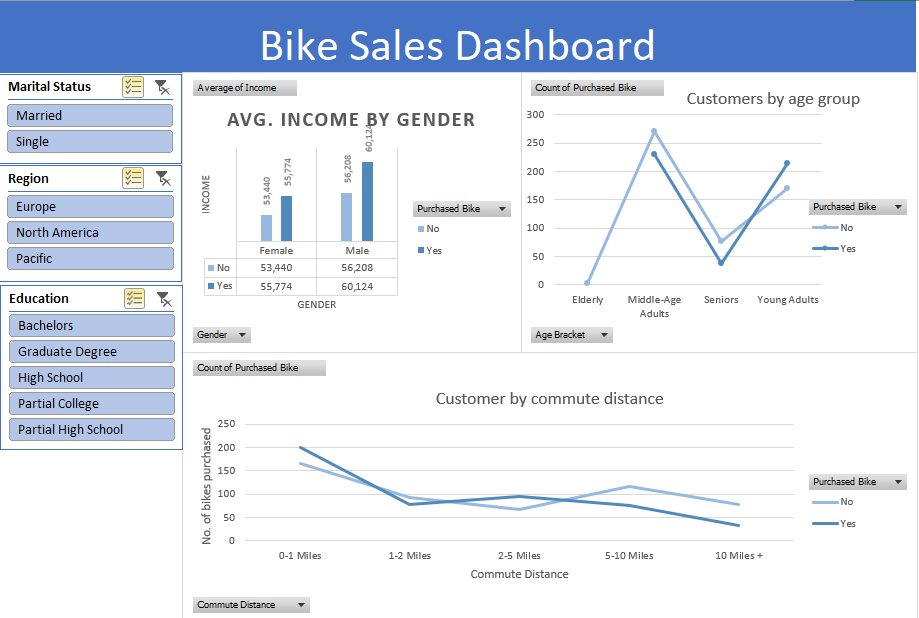

# Sales Dashboard (Excel)

An interactive dashboard built in Microsoft Excel using PivotTables, slicers, and charts to analyze sales performance.

## Features:
- Average income of customers based on their gender
- Count of customers based on their age group
- Count of customers based on their commute distance
- Interactive filters

## Preview:

## How to Use:
1. Open `Sales_Dashboard.xlsx`
2. Use slicers to filter by marital status, region, or education status
